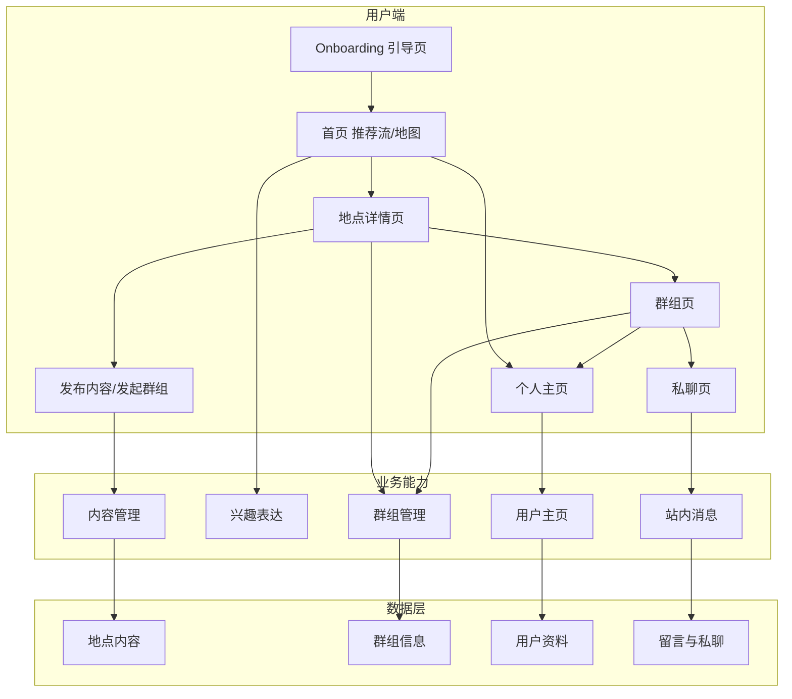
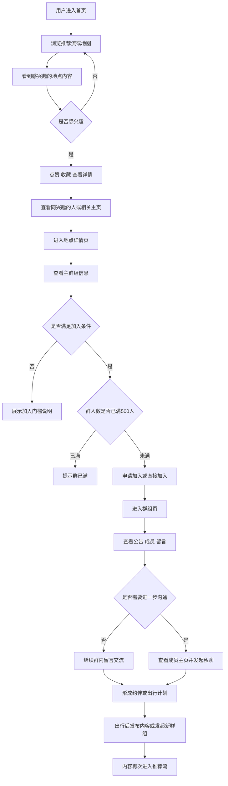

# gowow 旅行匹配平台 Demo PRD

## 1. 产品概述与架构

### 1.1 核心定位
`gowow` 是一个以内容驱动关系连接的旅行匹配平台，为爱旅行、有行动力的年轻用户提供地点发现、兴趣匹配、群组交流和站内沟通能力，解决“去哪玩”和“跟谁去”的双重痛点，通过 `地点内容 + 时间/玩法群组 + 站内轻社交` 实现快速约伴与出行决策。

### 1.2 整体架构图



### 1.3 核心业务流程



### 1.4 核心页面与现有 Demo 对应关系

| PRD 页面 | 现有 Demo 页面 | 处理方式 |
|---------|---------------|---------|
| 引导页 | Onboarding | 保留 |
| 首页 | HomeFeed | 保留并作为核心入口 |
| 地点详情页 | PlaceDetail | 保留并新增主群组模块 |
| 发布内容/发起群组 | WriteReview | 改造 |
| 个人主页 | Profile | 改造为旅行社交主页 |
| 群组页 | 无 | 新增 |
| 私聊页 | 无 | 新增 |
| AI 行程规划 | AITripPlanner | 降级为非核心 Demo 页面 |

---

## 2. 详细功能列表与权限矩阵

| 关键模块 | 核心功能点 | 主要权限角色 | 设计要点与边界 |
|---------|-----------|-------------|---------------|
| 引导与进入 | Onboarding 引导 | 游客/新用户 | 用于传达产品价值，完成首次进入首页 |
| 首页探索 | 推荐流 | 所有用户 | 基于现有 HTML，采用 Tinder 左右滑；卡片展示作者、媒体、地点、距离、正文摘要、AI 提炼、多维评分 |
| 首页探索 | 地图入口 | 所有用户 | 与推荐流双入口并列；Demo 阶段可先实现基础地点浏览 |
| 首页探索 | 搜索 | 所有用户 | 关键词搜索地点与内容；MVP 异常场景从简处理 |
| 兴趣表达 | 左滑跳过 | 所有用户 | 快速略过内容，不进入后续链路 |
| 兴趣表达 | 右滑喜欢 | 所有用户 | 作为兴趣表达主动作，用于后续人群/群组推荐 |
| 兴趣表达 | 上滑收藏 | 所有用户 | 标记感兴趣内容，便于后续回看 |
| 内容浏览 | 全屏媒体浏览 | 所有用户 | 点击图片/视频进入沉浸式浏览 |
| 内容浏览 | 地点详情 | 所有用户 | 展示地点主信息、AI 提炼、多维评分、游记/评论、主群组信息 |
| 群组 | 主群组展示 | 所有用户 | 一个地点只展示 1 个主群组；展示群名称、地点、时间、玩法、人数、加入门槛 |
| 群组 | 申请加入/直接加入 | 已登录用户 | 是否申请或直接加入由群门槛决定；单群最多 500 人 |
| 群组 | 群公告 | 群成员/浏览者 | 未加入用户可预览基础信息与公告摘要 |
| 群组 | 群内留言 | 已加入成员 | MVP 采用留言列表，不做复杂帖子流 |
| 群组 | 成员浏览 | 所有用户/群成员 | 展示部分成员头像昵称；可点击进入主页 |
| 私聊 | 站内私聊 | 已登录用户 | 从群成员列表或对方主页进入；仅支持文本消息 |
| 用户主页 | 旅行主页 | 已登录用户/所有用户 | 展示头像、标签、去过的地方、发布内容、群组参与情况 |
| 发布 | 发布内容 | 已登录用户 | 基于现有发布页改造；支持地点、正文、图片、时间、玩法 |
| 发布 | 发起群组 | 已登录用户 | 发布内容时可同步创建 `地点 + 时间/玩法` 群组 |
| 详情辅助 | 评价 | 已登录用户 | 现有评价入口保留，作为内容丰富机制存在 |
| 详情辅助 | 导航 | 所有用户 | 现有导航入口保留，作为地点转化辅助能力 |
| 非核心 | AI 行程规划 | 所有用户 | 保留在 Demo 中展示，但不作为主路径核心 |

---

## 3. 后台原型页面全集

### 3.1 菜单结构定义

```text
一级菜单：内容管理
├── 二级页面：地点内容列表
├── 二级页面：发布审核（可选）
└── 二级页面：标签管理

一级菜单：群组管理
├── 二级页面：群组列表
├── 二级页面：群公告管理
└── 二级页面：入群门槛配置

一级菜单：用户管理
├── 二级页面：用户列表
├── 二级页面：用户主页审核（可选）
└── 二级页面：封禁与举报处理

一级菜单：消息管理
├── 二级页面：群留言管理
└── 二级页面：私聊投诉处理

一级菜单：运营配置
├── 二级页面：推荐流配置
├── 二级页面：首页地图配置
└── 二级页面：Banner/引导配置
```

### 3.2 页面详细描述

**页面名称**：地点内容列表  
**所属菜单**：内容管理 -> 地点内容列表  
**页面用途**：查看和管理平台内所有地点内容、攻略分享和约伴相关内容。

| 区域 | 元素与交互描述 |
|-----|---------------|
| **A. 页面导航与全局状态** | 位于「内容管理」->「地点内容列表」。页内可按内容状态切换：全部、已发布、待处理、已下线 |
| **B. 筛选与查询区** | 支持按地点名、作者、内容关键词搜索；支持按时间、玩法、状态筛选 |
| **C. 主要操作栏** | 提供「新增内容」「批量下线」「导出列表」等按钮；根据角色控制是否可见 |
| **D. 核心内容展示区** | 表格展示内容标题、地点、作者、发布时间、关联群组、状态；行级操作包括查看、编辑、下线 |
| **E. 详情/编辑面板** | 点击新增/编辑后弹出抽屉或详情页，编辑地点、正文、图片、时间、玩法、关联群组信息 |
| **F. 其他独立视图/子页面** | 点击查看可进入内容详情后台页，看到内容正文、关联地点、关联群组、互动数据 |

**页面名称**：群组列表  
**所属菜单**：群组管理 -> 群组列表  
**页面用途**：管理按地点与时间/玩法组织的兴趣群组。

| 区域 | 元素与交互描述 |
|-----|---------------|
| **A. 页面导航与全局状态** | 位于「群组管理」->「群组列表」。状态可分为全部、开放加入、需申请、已满员、已关闭 |
| **B. 筛选与查询区** | 支持按群名称、地点、玩法、发起人搜索；支持按人数状态、时间范围筛选 |
| **C. 主要操作栏** | 支持「创建群组」「批量关闭」「导出成员」等操作 |
| **D. 核心内容展示区** | 列表展示群名称、地点、时间、玩法、人数、门槛、状态；行级操作包括查看、编辑、关闭 |
| **E. 详情/编辑面板** | 可配置群公告、加入门槛、人数上限、群封面、发起人信息 |
| **F. 其他独立视图/子页面** | 可查看群成员列表和群内留言列表，用于运营排查和内容管理 |

**页面名称**：用户列表  
**所属菜单**：用户管理 -> 用户列表  
**页面用途**：查看平台用户基本信息、主页状态与内容参与情况。

| 区域 | 元素与交互描述 |
|-----|---------------|
| **A. 页面导航与全局状态** | 位于「用户管理」->「用户列表」。页内可切换全部、正常、限制中、被举报 |
| **B. 筛选与查询区** | 支持按昵称、用户ID、地点偏好、注册时间搜索与筛选 |
| **C. 主要操作栏** | 支持导出、批量标记、批量封禁等操作 |
| **D. 核心内容展示区** | 展示头像、昵称、标签、发布数、入群数、最近活跃时间；行级操作为查看主页、限制、备注 |
| **E. 详情/编辑面板** | 查看用户主页配置、历史发布、群组参与记录、私聊投诉记录 |
| **F. 其他独立视图/子页面** | 可跳转到该用户的内容列表或举报处理视图 |

**页面名称**：群留言管理  
**所属菜单**：消息管理 -> 群留言管理  
**页面用途**：查看群组中的留言内容，处理违规信息。

| 区域 | 元素与交互描述 |
|-----|---------------|
| **A. 页面导航与全局状态** | 位于「消息管理」->「群留言管理」。页内按全部、待处理举报、已删除切换 |
| **B. 筛选与查询区** | 支持按群组、用户、关键词、时间范围筛选 |
| **C. 主要操作栏** | 提供批量删除、批量忽略举报、导出留言记录 |
| **D. 核心内容展示区** | 展示留言内容、发送人、群组、发送时间、举报状态；行级操作为查看上下文、删除、忽略 |
| **E. 详情/编辑面板** | 查看留言上下文、关联用户主页、相关举报原因 |
| **F. 其他独立视图/子页面** | 可进入举报详情页联动查看私聊或用户行为 |

**页面名称**：推荐流配置  
**所属菜单**：运营配置 -> 推荐流配置  
**页面用途**：配置首页推荐流展示顺序、人工置顶内容和地图展示策略。

| 区域 | 元素与交互描述 |
|-----|---------------|
| **A. 页面导航与全局状态** | 位于「运营配置」->「推荐流配置」。支持推荐流/地图配置 Tab 切换 |
| **B. 筛选与查询区** | 支持按地点、玩法、内容类型、发布时间筛选候选内容 |
| **C. 主要操作栏** | 支持置顶、取消置顶、设置推荐标签、恢复默认排序 |
| **D. 核心内容展示区** | 展示候选内容列表及当前推荐位顺序 |
| **E. 详情/编辑面板** | 编辑推荐说明、展示时段、人工权重 |
| **F. 其他独立视图/子页面** | 地图配置可定义地点点位是否展示、文案说明等 |

### 3.3 移动端前台关键页面原型描述

#### 页面名称：首页推荐流
**页面用途**：用户快速发现地点内容并表达兴趣。

```text
+---------------------------------------------------+
| gowow                         [推荐流] [地图]     |
| [ 搜索全球隐秘角落...                     ][搜] |
+---------------------------------------------------+
|                                                   |
|  [作者头像] 航拍世界                              |
|  +---------------------------------------------+  |
|  |               图片/视频封面                  |  |
|  +---------------------------------------------+  |
|  绝美海岸线的上帝视角                            |
|  菲律宾·巴拉望 | 距您 1240 km                    |
|  正文摘要...                                      |
|  AI 真实提炼...                                   |
|  自然 5.0  探险 4.8  出片 5.0                     |
|                                                   |
|      [X 左滑跳过]  [↑ 上滑收藏]  [♥ 右滑喜欢]    |
+---------------------------------------------------+
| [探索]               [规划]               [我的]  |
+---------------------------------------------------+
```

#### 页面名称：地点详情页
**页面用途**：进一步了解地点价值，并看到与该地点关联的主群组。

```text
+---------------------------------------------------+
| [返回]                                            |
| +-----------------------------------------------+ |
| |               地点封面图                      | |
| +-----------------------------------------------+ |
| 阿婆的隐秘冬阴功粉                                |
| 泰国·曼谷·辉煌区老巷23号                          |
| AI 提炼说明...                                    |
|                                                   |
| 多维真实评价                                      |
| 口味 4.9  环境 1.2  服务 2.5 ...                 |
|                                                   |
| 主群组                                            |
| 曼谷夜市暴走局                                    |
| 地点：曼谷辉煌区                                  |
| 时间：周五晚 20:00                                |
| 玩法：夜市觅食 / 攻略分享 / 约伴                  |
| 人数：128/500  门槛：喜欢该地点即可加入           |
| [申请加入/直接加入]                               |
|                                                   |
| 游记 / 评论列表                                   |
| ...                                               |
+---------------------------------------------------+
| [评价] [导航] [发布内容/发起群组] [加入群组]      |
+---------------------------------------------------+
```

#### 页面名称：群组页
**页面用途**：在一个地点+时间/玩法场景下完成群内浏览和交流。

```text
+---------------------------------------------------+
| [返回] 曼谷夜市暴走局                             |
| 曼谷 · 周五晚 20:00 · 夜市觅食                    |
| 128/500人  门槛：喜欢该地点即可加入               |
| 公告：本群以真实约伴和攻略分享为主                |
+---------------------------------------------------+
| 成员预览  [头像] [头像] [头像] [更多]             |
+---------------------------------------------------+
| 留言列表                                          |
| A: 我周五晚上会先去辉煌夜市                        |
| B: 有第一次去曼谷的吗？                           |
| C: 有推荐路线可以抄作业吗？                       |
| ...                                               |
+---------------------------------------------------+
| [输入留言...]                             [发送] |
+---------------------------------------------------+
```

#### 页面名称：私聊页
**页面用途**：用户在站内进一步一对一交流。

```text
+---------------------------------------------------+
| [返回] 背包客老麦                                 |
+---------------------------------------------------+
| 对话列表                                          |
| 我：这周五你也去曼谷夜市吗？                      |
| TA：对，我主要想吃当地小吃                         |
| 我：那我们可以在群里先对下路线                    |
| ...                                               |
+---------------------------------------------------+
| [输入消息...]                             [发送] |
+---------------------------------------------------+
```

#### 页面名称：发布内容/发起群组页
**页面用途**：发布地点内容，并可同步发起主群组。

```text
+---------------------------------------------------+
| [返回] 发布内容                                   |
+---------------------------------------------------+
| 地点： [选择地点]                                 |
| 时间： [选择时间]                                 |
| 玩法： [夜市觅食 v]                               |
| 正文：                                            |
| +-----------------------------------------------+ |
| | 分享你的玩法、攻略或约伴信息...               | |
| +-----------------------------------------------+ |
| 图片： [添加实拍]                                 |
| [ ] 同时发起群组                                  |
| 加入门槛： [喜欢该地点即可加入 v]                 |
+---------------------------------------------------+
|                    [发布]                         |
+---------------------------------------------------+
```

---

## 4. 非功能需求

### 4.1 性能需求
- 首页推荐流首屏加载目标小于 2 秒
- 卡片滑动与切换需保持顺滑，无明显卡顿
- 页面核心操作反馈应明确，点击后有即时状态变化

### 4.2 安全需求
- 站内消息与用户资料需有基础访问控制
- 群留言与私聊需支持内容举报和后台处理
- 后台需记录关键运营操作日志

### 4.3 兼容性需求
- Demo 优先适配移动端竖屏
- 浏览器以 Chrome 最新版为主要演示环境
- 页面支持移动端常见分辨率模拟展示

### 4.4 可用性需求
- 无内容、已满员、未满足门槛等状态需有明确提示
- 未加入群组用户可预览基础信息，但不能发言
- 私聊页面需保证最基础的可发送、可回看能力

---

## 5. 项目规划

### 5.1 里程碑规划

| 阶段 | 时间 | 交付物 | 验收标准 |
|-----|------|--------|---------|
| 第一阶段 | Demo 周期 1 | 首页 + 详情 + 发布页改造 | 推荐流主流程可跑通 |
| 第二阶段 | Demo 周期 2 | 群组页 + 个人主页 | 内容到群组链路可跑通 |
| 第三阶段 | Demo 周期 3 | 私聊页 + 地图基础视图 | 站内沟通与完整闭环可演示 |

### 5.2 风险与应对

| 风险 | 影响 | 应对措施 |
|-----|------|---------|
| 现有 Demo 偏点评平台 | 主线跑偏 | 以“地点内容 + 群组 + 私聊”为主线重构页面叙事 |
| 群组与私聊新增页面较多 | 开发时间增加 | 先做 MVP 页面，仅保留最小交互能力 |
| 地图页现有实现缺失 | 双入口体验不完整 | Demo 阶段先做基础点位浏览，占位高级能力 |
| 内容字段过多 | 发布成本高 | 收敛为地点、正文、图片、时间、玩法、是否发群 |

---

## 6. MVP 范围

### 6.1 必做
- Onboarding 引导
- 首页推荐流/地图双入口
- 左右滑兴趣表达
- 地点详情页
- 主群组模块
- 群组页（公告、成员预览、留言列表）
- 私聊页（文本消息）
- 发布内容/发起群组
- 个人主页改造

### 6.2 可选增强
- 地图真实点位交互增强
- 群组加入审核流细化
- 推荐流内容类型标签
- 内容举报与后台审核细化

### 6.3 暂不做
- 复杂聊天能力（图片、语音、撤回、已读）
- 多群组并列与复杂群运营
- 完整成就体系
- AI 行程规划深度能力

---

## 7. 需要确认的边界情况

1. 群组加入门槛的枚举值是否需要在 Demo 中固定为 2-3 类标准选项。
2. 地图页是展示真实地图 SDK，还是使用伪地图点位即可满足路演需要。
3. “同兴趣的人”是否作为独立页面补充，还是在群组页/主页中被吸收。
4. 私聊是否需要基础的举报或拉黑入口。
5. 发布内容后是否默认立即公开，还是需要审核态占位。
